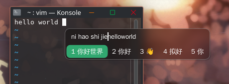

# fcitx5-glass-self

[中文](README.md) | **English**

An Fcitx5 candidate window theme, derived from
[sanweiya/fcitx5-mellow-themes](https://github.com/sanweiya/fcitx5-mellow-themes)
(`mellow-graphite-dark`). The goal is a **translucent glass look with KWin background
blur and rounded corners**.

This is a **personal configuration**: opacity, blur region and highlight color are tuned
to personal preference. It is published for reference or direct reuse. The upstream
attribution and license are listed at the end of this file.

- Theme directory name: `glass-self`
- Display name: `Glass Self`

## Contents

- [Preview](#preview)
- [Features](#features)
- [Requirements](#requirements)
- [Input method installation](#input-method-installation)
- [Theme installation](#theme-installation)
- [Customization](#customization)
  - [Opacity](#opacity)
  - [Highlight color](#highlight-color)
- [Layout](#layout)
- [Known limitations](#known-limitations)
- [Related projects](#related-projects)
- [Field notes](#field-notes)
- [Credits](#credits)
- [License](#license)

## Preview

Candidate window while typing Pinyin in Konsole (translucent rounded background with a
green highlight):


The candidate window in panel mode (with "Show preedit in application" turned off, the
pinyin string is displayed inside the candidate window):



## Features

| Feature | Implementation |
| --- | --- |
| Translucent background | `fill-opacity: 0.4` in `panel.svg` (measured alpha ~0.52) |
| KWin background blur | `EnableBlur=True` in `theme.conf` |
| Rounded blur region | `BlurMask=blur-mask.png`, so the area outside the rounded corners is not blurred |
| Fixed highlight color | `#31a870`, taken from the upstream mellow-wechat palette |

## Requirements

- **fcitx5**: `EnableBlur` / `BlurMask` require 5.1.x (tested on 5.1.22)
- **KWin**: blur is requested via the Wayland `ext_background_effect_manager_v1` protocol
- **rsvg-convert** (librsvg): used to build the PNG artifacts from the SVG sources
  (`sudo pacman -S librsvg`)

## Input method installation

This theme only covers the looks; typing needs fcitx5 plus Rime first. The commands below are
for Arch-based systems and match what was measured on this machine (version list at the end
of this section).

### Official repositories (extra)

```bash
sudo pacman -S fcitx5-im fcitx5-rime librime
```

`fcitx5-im` is a group containing `fcitx5` (the daemon), `fcitx5-configtool` (GUI settings),
`fcitx5-gtk` and `fcitx5-qt` (input modules for GTK and Qt applications, which X11 and
XWayland apps rely on).

Scheme data lives in extra as well, install what you need:

```bash
sudo pacman -S rime-prelude rime-essay rime-luna-pinyin rime-terra-pinyin rime-stroke
```

The meta package `librime-data` pulls in the preset data in one go. If you prefer not to use
Rime at all, `fcitx5-chinese-addons` ships Pinyin, double Pinyin and Wubi.

### Rime Ice and Wanxiang (archlinuxcn)

Rime Ice and the Wanxiang family live in the third-party archlinuxcn repository. Append the
following to the end of `/etc/pacman.conf` (swap the mirror as needed):

```ini
[archlinuxcn]
Server = https://mirrors.ustc.edu.cn/archlinuxcn/$arch
```

Install the keyring first, then the packages:

```bash
sudo pacman -Sy archlinuxcn-keyring  # keyring first
sudo pacman -S rime-ice-git          # Rime Ice: scheme + dictionaries
sudo pacman -S rime-wanxiang-pinyin rime-wanxiang-data rime-wanxiang-gram-zh-hans
                                     # Wanxiang: full Pinyin scheme, data, grammar model
```

Packages install into `/usr/share/rime-data/`; keep personal changes in
`~/.local/share/fcitx5/rime/*.custom.yaml` rather than editing the system directory, since
upgrades overwrite it.

**The grammar model does not need a manual download.** `rime-wanxiang-gram-zh-hans` is that
roughly 400 MB model (347 MiB download, 400 MiB installed), and letting the package manager
track it beats keeping a hand-placed copy. This machine currently uses a manually placed
`wanxiang-lts-zh-hans.gram` in the user directory; if you switch to the package, move that
copy away first so two models are not scanned at once.

### Environment and startup

- Wayland (KDE Plasma): no input-method environment variables needed. KWin hands over through
  `zwp_input_method_v2`, configured by `[Wayland] InputMethod=` in `kwinrc` (here it points at
  `/usr/share/applications/org.fcitx.Fcitx5.desktop`).
- X11 and XWayland applications: need `XMODIFIERS=@im=fcitx` (set in `/etc/environment`
  here); older GTK and Qt applications on X11 additionally want `GTK_IM_MODULE=fcitx` and
  `QT_IM_MODULE=fcitx`.
- Autostart: drop `org.fcitx.Fcitx5.desktop` into the session (here it lives in
  `~/.config/autostart/`), or search for "Virtual Keyboard" in System Settings and pick fcitx5 there (its location
  differs between Plasma versions, so searching is the reliable route).
- Start manually with `fcitx5 -d`; `fcitx5-remote --check` tells you whether it is running.

### After installing

1. `Ctrl+Space` to bring up the input method; `fcitx5-remote -n` shows the current input method name.
2. Configure groups and schemes with `fcitx5-configtool` (safer than editing
   `~/.config/fcitx5/profile` by hand).
3. Trigger the Rime redeploy: tray icon, right click, Rime, redeploy (there is no CLI entry
   point, see Related projects).
4. Install this theme, see "Theme installation".

Measured on this machine (2026-09-16): fcitx5 5.1.22 / fcitx5-rime 5.1.16 / librime 1.17.0 /
fcitx5-qt 5.1.15 / fcitx5-gtk 5.1.7 / fcitx5-configtool 5.1.15 / rime-ice-git r994, all from
extra plus archlinuxcn, nothing built by hand.

## Theme installation

The commands below install this repository's theme, not the input method itself (for that
see the previous section, "Input method installation").

```bash
git clone https://github.com/GT001well/fcitx5-glass-self.git
cd fcitx5-glass-self

./build.sh     # SVG sources -> PNG artifacts
./install.sh   # install into ~/.local/share/fcitx5/themes/ and push to a running fcitx5
```

The input method process is not restarted; the configuration is pushed to the running
instance over DBus.

## Customization

### Opacity

Edit the `fill-opacity` of the background path in `theme/panel.svg`, then rebuild.
Measured values:

| fill-opacity | Actual alpha |
| --- | --- |
| 0.3 | 0.40 |
| 0.4 | 0.52 (current) |
| 0.5 | 0.63 |
| 0.6 | 0.72 |
| 0.7 | 0.81 |

The measured alpha is higher than the configured value because the SVG contains a drop
shadow filter.

### Highlight color

Edit the `fill` value in `theme/highlight.svg`, then run `./build.sh`.

## Layout

```
theme/
  theme.conf          theme definition
  panel.svg/.png      candidate window background (rounded, translucent)
  highlight.svg/.png  candidate highlight block
  blur-mask.svg/.png  blur region mask
assets/
  preview.png         screenshot used by the README
  panel-mode.png      candidate window in panel mode
conf/
  classicui.conf      generated fcitx5 configuration, kept as a reference
build.sh              SVG -> PNG
install.sh            install and push
```

## Known limitations

- **The highlight color cannot follow the system accent color.** In fcitx5, `ThemeImage`
  is either an image or a solid color, never both. An image is required for rounded
  corners but then the color is fixed in the image; a solid color can follow the accent
  color but is drawn as a plain rectangle. This theme keeps the rounded corners.
- **Blur requires KWin.** On compositors that do not implement
  `ext_background_effect_manager_v1` the blur simply does not appear; the rest of the
  theme is unaffected.

## Related projects

This theme only covers the appearance of the candidate window. If you use a Rime schema,
pairing it with the **Wanxiang** grammar model improves the ranking of long-sentence
candidates (without it the input method still works; long sentences simply rely on word
frequency):

- [amzxyz/rime-wanxiang](https://github.com/amzxyz/rime-wanxiang): the input scheme
- [amzxyz/RIME-LMDG](https://github.com/amzxyz/RIME-LMDG): grammar model and dictionary
  data. The LTS model `wanxiang-lts-zh-hans.gram` is about 420 MB; download it from that
  project's Releases page

The model file is too large to ship with this repository, so it is only linked upstream;
upstream keeps it current, which is more reliable than freezing a copy.

On Arch with the archlinuxcn repository enabled you can just install `rime-wanxiang-gram-zh-hans`
(see [Input method installation](#input-method-installation)); there is no need to download
that roughly 420 MB (400 MiB) model by hand.

Notes from testing on fcitx5 5.1.22:

```bash
# 1. download into the Rime user directory (the release page lists a sha256, verify it)
cd ~/.local/share/fcitx5/rime
curl -LO https://github.com/amzxyz/RIME-LMDG/releases/download/LTS/wanxiang-lts-zh-hans.gram
sha256sum wanxiang-lts-zh-hans.gram   # expected 8f1b2d3ed2b2755fdd445f6ab103eff613052080b62a0c049f4b166043a16ac4
# that value belongs to the current LTS asset; trust the release page if upstream repacks it

# 2. write the scheme-level configuration (see above)
# 3. trigger the redeploy (next step)
```

The values come from
[manateelazycat/rime-ice-installer](https://github.com/manateelazycat/rime-ice-installer),
where they are already validated; `grammar/language` takes the model filename without the
`.gram` extension:

```yaml
# ~/.local/share/fcitx5/rime/rime_ice.custom.yaml
patch:
  "grammar/language": wanxiang-lts-zh-hans        # model filename without the .gram suffix
  "grammar/collocation_max_length": 7             # max phrase length for collocation scoring
  "grammar/collocation_min_length": 2             # lower bound (both are irrelevant for full-sentence input)
  "grammar/collocation_penalty": -10              # reward for a valid collocation
  "grammar/non_collocation_penalty": -20          # penalty for a non-collocation
  "grammar/weak_collocation_penalty": -35         # penalty for a weak collocation
  "grammar/rear_penalty": -12                     # penalty when it lands at the end of a sentence
  "translator/contextual_suggestions": false      # context weighting: true scores candidates using recently committed text
  "translator/max_homophones": 5                  # how many homophone candidates per position
  "translator/max_homographs": 5                  # how many homograph candidates per position
```

The semantics of those comments were checked against the librime source: `contextual_suggestions`
decides whether `Poet::ContextualWeighted()` scores candidates against the preceding text and
the committed history (cross-sentence association), a separate mechanism from the in-sentence
`grammar/*` keys; `max_homophones` is the bound of that
`while (homophones.size() < max_homophones())` loop.

Note that this goes into a **scheme-level** file (`rime_ice.custom.yaml`), not the global
`default.custom.yaml`: `grammar/*` and `translator/max_*` are keys of the schema.

**Rime's redeploy has no command-line entry point.** `fcitx5-remote -r` only reloads the
fcitx configuration, the `/rime` DBus interface only exposes schema switching and state
queries, and deactivating then reactivating the input method does not trigger it either.
The only way in is the tray icon: right click, Rime, redeploy. Do not move `build/` away
before confirming how to trigger the redeploy.

Memory footprint measured with the 420 MB model: 400 MB is mapped into the address space
but the resident set is only 64 KB, growing page by page with use. The fcitx5 process RSS
went from 117 MB to 174 MB, most of which is the compiled index and build artifacts
rather than the model itself.

## Field notes

Environment: fcitx5 5.1.22 / KWin 6.7.5 / Wayland

- `classicui.conf` uses bare key/value pairs and **must not contain a section header**
  (writing `[ClassicUI]` makes the whole file unreadable).
- `Theme=` takes the **theme directory name**, not the `Name` from `theme.conf`. The
  system theme directory is `default` while its `theme.conf` carries the localized name
  "Per defecte", which makes a useful cross-check.
- Changing the configuration **does not require restarting fcitx5**:

  ```bash
  gdbus call --session --dest org.fcitx.Fcitx5 --object-path /controller \
    --method org.fcitx.Fcitx.Controller1.SetConfig "fcitx://config/addon/classicui" "<{...}>"
  ```

  Editing the file alone, or calling `ReloadConfig`, will not make a running instance
  pick up the new values.
- After changing theme files, force a reload by switching `Theme` to another theme and
  back.
- With `BlurMask` left empty the blur region is a plain rectangle, so the area outside
  the rounded corners is blurred as well; supplying a rounded mask image fixes it.
- A theme directory created while fcitx5 is already running is still picked up, as long
  as `Theme=` holds the correct directory name.
- **Moving the insertion point inside a pinyin string with the arrow keys shows no cursor.**
  Rime 1.17's `navigator` really does bind `←`/`→` to character-wise movement
  (`left_by_char_no_loop`) and `Shift` plus the arrow keys to syllable-wise movement
  (`left_by_syllable`; both can be checked in the Rime Ice `default.yaml`), and the candidate
  list follows, but there is no visible insertion point. Two reasons: fcitx5-rime's `PreeditCursorPositionAtBeginning`
  (default `true` on Linux; the source comment says it keeps the candidate window from
  jumping) forces the embedded preedit cursor to 0, and the application side (measured in
  KWrite) only paints a highlight block over the pinyin and draws no bar at all, not even a
  blinking one.
- To see the position while typing, the preedit has to go through fcitx5's own candidate
  panel instead: turn off "Show preedit in application" (temporarily `Ctrl+Alt+P`). The
  pinyin line in the panel then carries a real vertical caret that follows the arrow keys;
  the trade-off is that the pinyin is no longer inline and you lose the surrounding context.
  See the second image under Preview.
- Every addon config under `conf/`, like `classicui.conf`, uses bare key/value pairs and
  **must not contain a section header** (e.g. `rime.conf` with
  `PreeditCursorPositionAtBeginning=False`; adding a `[Rime]` header makes the whole file
  unreadable).

## Credits

- [sanweiya/fcitx5-mellow-themes](https://github.com/sanweiya/fcitx5-mellow-themes):
  base theme and rounded-corner assets (BSD-2-Clause)
- [fcitx5](https://github.com/fcitx/fcitx5): input method framework

## License

BSD-2-Clause, see [LICENSE](LICENSE). This project is a derivative work of the upstream
theme above; the original license text is kept in the repository.
