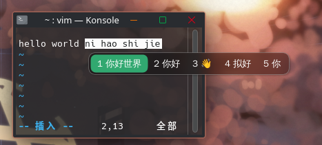

# fcitx5-glass-self

**中文** | [English](README.en.md)

一个 Fcitx5 候选窗主题，基于 [sanweiya/fcitx5-mellow-themes](https://github.com/sanweiya/fcitx5-mellow-themes)
的 `mellow-graphite-dark` 改造，目标是**半透明玻璃质感 + KWin 背景模糊 + 圆角形状**。

这是一份**个人自用**的主题配置：透明度、模糊范围与高亮色均按个人习惯调整，公开出来供参考或直接取用。
上游出处与许可证见文末。

- 主题目录名：`glass-self`
- 显示名：`Glass Self`

## 目录

- [效果](#效果)
- [特性](#特性)
- [环境要求](#环境要求)
- [安装](#安装)
- [自定义](#自定义)
  - [透明度](#透明度)
  - [高亮色](#高亮色)
- [目录结构](#目录结构)
- [已知限制](#已知限制)
- [相关项目](#相关项目)
- [实测记录](#实测记录)
- [致谢](#致谢)
- [许可证](#许可证)

## 效果

在 Konsole 中键入拼音时的候选窗（半透明圆角底 + 绿色高亮）：



## 特性

| 特性 | 实现 |
| --- | --- |
| 半透明背景 | `panel.svg` 的 `fill-opacity: 0.4`（实测 alpha 约 0.52） |
| KWin 背景模糊 | `theme.conf` 的 `EnableBlur=True` |
| 圆角模糊区域 | `BlurMask=blur-mask.png`，避免圆角外侧一并被模糊 |
| 固定高亮色 | `#31a870`，与上游 mellow-wechat 配色同源 |

## 环境要求

- **fcitx5**：`EnableBlur` / `BlurMask` 需 5.1.x（实测 5.1.22）
- **KWin**：模糊经 Wayland 的 `ext_background_effect_manager_v1` 协议实现
- **rsvg-convert**（librsvg）：用于由 SVG 源生成 PNG 产物

## 安装

```bash
./build.sh     # SVG 源 -> PNG 产物
./install.sh   # 安装到 ~/.local/share/fcitx5/themes/ 并推给运行中的 fcitx5
```

安装不重启输入法进程；配置通过 DBus 推送给运行中的实例。

## 自定义

### 透明度

修改 `theme/panel.svg` 中背景路径的 `fill-opacity`，随后重新构建。实测对照：

| fill-opacity | 实际 alpha |
| --- | --- |
| 0.3 | 0.40 |
| 0.4 | 0.52（当前） |
| 0.5 | 0.63 |
| 0.6 | 0.72 |
| 0.7 | 0.81 |

实测值高于填写值，原因是 SVG 内叠加有投影滤镜。

### 高亮色

修改 `theme/highlight.svg` 的 `fill`，随后执行 `./build.sh`。

## 目录结构

```
theme/
  theme.conf          主题定义
  panel.svg/.png      候选窗背景（圆角矩形，半透明）
  highlight.svg/.png  候选高亮块
  blur-mask.svg/.png  模糊区域遮罩
assets/
  preview.png         README 用的效果截图
conf/
  classicui.conf      fcitx5 生成的配置样本，供对照配置项
build.sh              SVG -> PNG
install.sh            安装与推送
```

## 已知限制

- **高亮色不能跟随系统强调色。** fcitx5 的 `ThemeImage` 在「背景图片」与「纯色」之间二选一：
  使用图片才有圆角，但颜色由图片固定；使用纯色才能跟随强调色，但退化为直角矩形。
  本主题选择保留圆角。
- **模糊依赖 KWin。** 合成器未实现 `ext_background_effect_manager_v1` 时模糊不生效，
  主题的其余部分不受影响。

## 相关项目

本主题只负责候选窗的外观。若你使用 Rime（中州韵）方案，搭配**万象拼音**的语法模型可以改善长句
候选的排序（不启用时输入法照常工作，只是长句会更依赖词频）：

- [amzxyz/rime-wanxiang](https://github.com/amzxyz/rime-wanxiang)：输入方案本体
- [amzxyz/RIME-LMDG](https://github.com/amzxyz/RIME-LMDG)：语法模型与词库数据。
  LTS 版 `wanxiang-lts-zh-hans.gram` 约 420 MB，请在该项目的 Releases 页面下载

模型文件体积过大，不适合随本仓库分发，因此仅指向上游；上游保持更新，比固化一份副本更可靠。

第二步的 `rime_ice.custom.yaml` 内容如下（值取自 [manateelazycat/rime-ice-installer](https://github.com/manateelazycat/rime-ice-installer)
已验证的参数；`grammar/language` 填模型文件名去掉 `.gram` 后缀的部分）：

```yaml
# ~/.local/share/fcitx5/rime/rime_ice.custom.yaml
patch:
  "grammar/language": wanxiang-lts-zh-hans
  "grammar/collocation_max_length": 7
  "grammar/collocation_min_length": 2
  "grammar/collocation_penalty": -10
  "grammar/non_collocation_penalty": -20
  "grammar/weak_collocation_penalty": -35
  "grammar/rear_penalty": -12
  "translator/contextual_suggestions": false
  "translator/max_homophones": 5
  "translator/max_homographs": 5
```

注意配置文件要挂在**方案级**（`rime_ice.custom.yaml`），不是全局的 `default.custom.yaml` ——
`grammar/*` 与 `translator/max_*` 都是方案（schema）里的键。

安装要点（实测于 fcitx5 5.1.22）：

```bash
# 1. 下载到 Rime 用户目录（上游 release 页给出 sha256，建议校验）
cd ~/.local/share/fcitx5/rime
curl -LO https://github.com/amzxyz/RIME-LMDG/releases/download/LTS/wanxiang-lts-zh-hans.gram
sha256sum wanxiang-lts-zh-hans.gram   # 应等于 8f1b2d3e...a16ac4

# 2. 写 scheme 级配置（内容见下）
# 3. 触发重新部署（下一步）
```

**注意：Rime 的「重新部署」没有命令行入口。** `fcitx5-remote -r` 只重载 fcitx 配置、
`/rime` 的 DBus 接口只有切方案与读状态、停用再激活也不触发部署。
入口只有一个：**输入法托盘图标 → 右键 → Rime → 重新部署**。
所以不要先动 `build/` 目录再去研究怎么触发——会把它悬在半路。

内存占用实测（420 MB 模型）：映射进地址空间 400 MB，**实际驻留 RSS 仅 64 KB**，
随使用按页增长；fcitx5 进程总 RSS 从 117 MB 涨到 174 MB，增量主要来自编译出的索引与
`build/` 产物，而非模型本身。

## 实测记录

环境：fcitx5 5.1.22 / KWin 6.7.5 / Wayland

- `classicui.conf` 为裸键值格式，**不能带段头**（写成 `[ClassicUI]` 会导致整个文件读取失败）。
- `Theme=` 填写**主题目录名**，而非 `theme.conf` 中的 `Name`。系统主题的目录名为 `default`，
  其 `theme.conf` 中的 `Name` 是本地化字符串「Per defecte」，可作旁证。
- 修改配置**无需重启 fcitx5**：

  ```bash
  gdbus call --session --dest org.fcitx.Fcitx5 --object-path /controller \
    --method org.fcitx.Fcitx.Controller1.SetConfig "fcitx://config/addon/classicui" "<{...}>"
  ```

  仅修改文件、或调用 `ReloadConfig`，运行中的实例都不会读取新值。
- 修改主题文件后需触发重载：将 `Theme` 切换到其他主题再切回，强制重新读取主题目录。
- `BlurMask` 留空时模糊区域为矩形，圆角外侧同样被模糊；提供圆角形状的遮罩图即可修正。
- 主题目录于运行期间新建同样可被识别，前提是 `Theme=` 填写的是正确的目录名。

## 致谢

- [sanweiya/fcitx5-mellow-themes](https://github.com/sanweiya/fcitx5-mellow-themes)：基础主题与圆角素材（BSD-2-Clause）
- [fcitx5](https://github.com/fcitx/fcitx5)：输入法框架

## 许可证

BSD-2-Clause，见 [LICENSE](LICENSE)。本项目为上述上游主题的衍生作品，原许可证文本随附保留。
